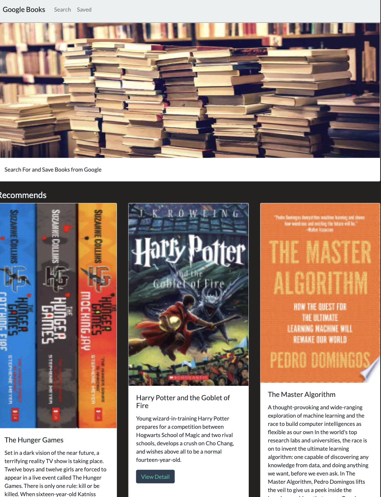
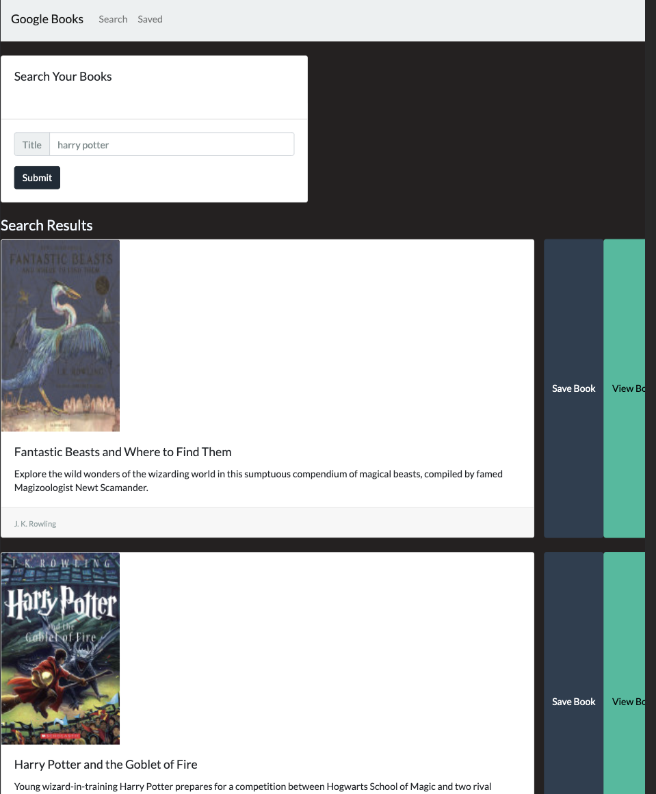
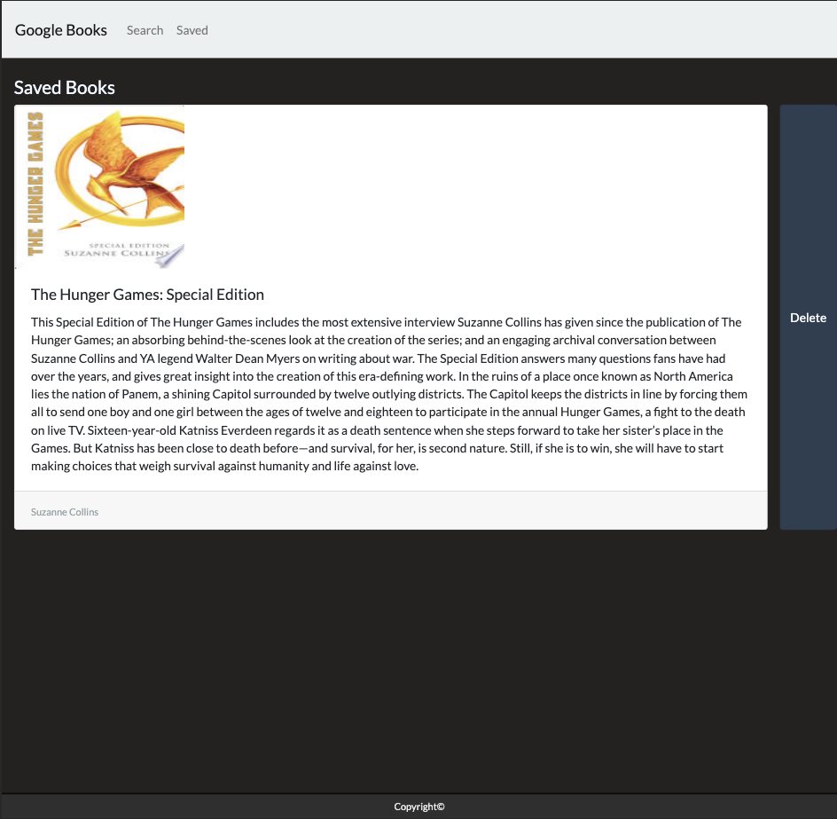

# Google Search Books
[google search books Deploy Application!](https://fierce-dusk-06536.herokuapp.com/) - https://fierce-dusk-06536.herokuapp.com/
Google Search Book is a  app where the user will be able to search book via google books API and store and delete the book data from the mongo DB.

* Home page shows the recommed books and the links to search and save page

* Search page will call the google books api via the user's input title.

* Save page will shows the books user saved from search page.

